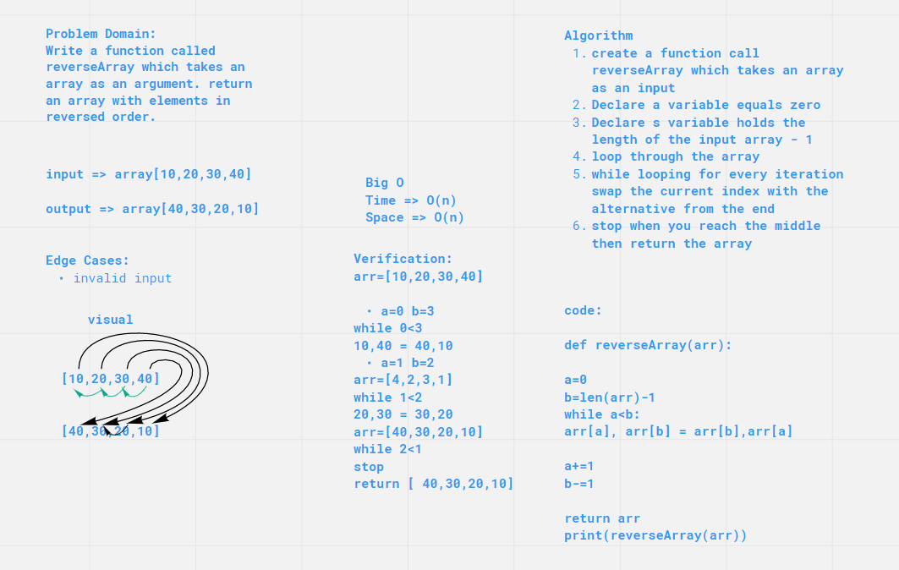

# Reverse an Array Day 1

a function called reverseArray which takes an array as an argument. return an array with elements in reversed order.

## Whiteboard Process

## Approach & Efficiency

Create function call reverseArray take an array as input, Declare variable equal 0, Declare variable hold length of the input array -1 , Loop through the array, while looping For every ietration swap the current index with the alternative from the end, Stop when you reach the middle than return the array.

Big O Time--> O(n)

Big O space--> O(n)
